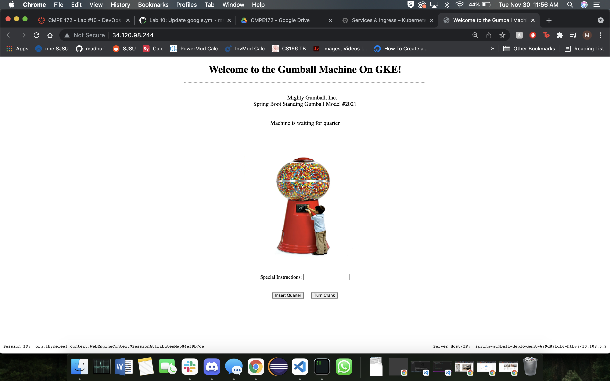

# Lab #10 - DevOps CI/CD

I followed all the steps given for this lab. Part 1 of the lab was straight forward for me, I was able to go through all the steps without any trouble. Part 2 of the lab got more confusing for me. I kept running into errors in while creating my release. The build wasn't working properly, I had permissions issues. It took me a while to figure out what the issue was but I basically had to regenerate my service account and create a new key, and the second time around I added permissions. I made myself the owner and also added my school email as well for more accessibility. After creating a new key, I had to update my Github Secrets and things worked smoothly after that. The rest of the steps/images show my workflow for this lab.

## CI Workflow Part 1

## CI Workflow Part 2

